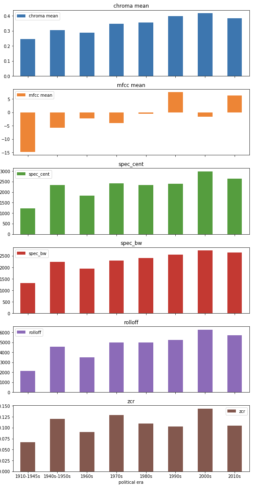
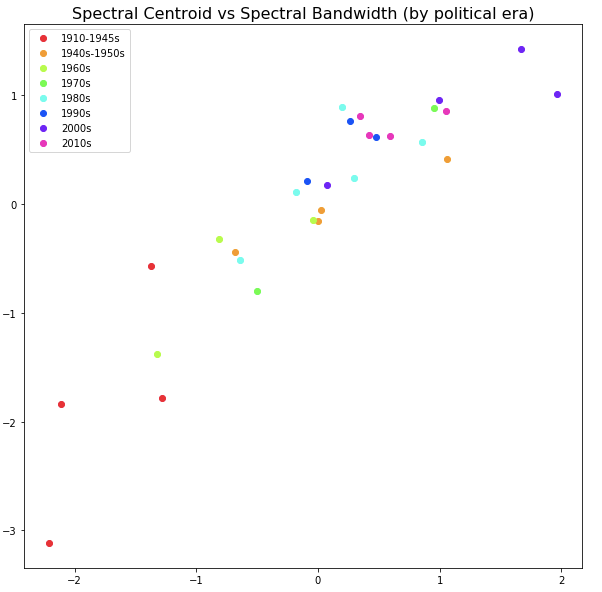
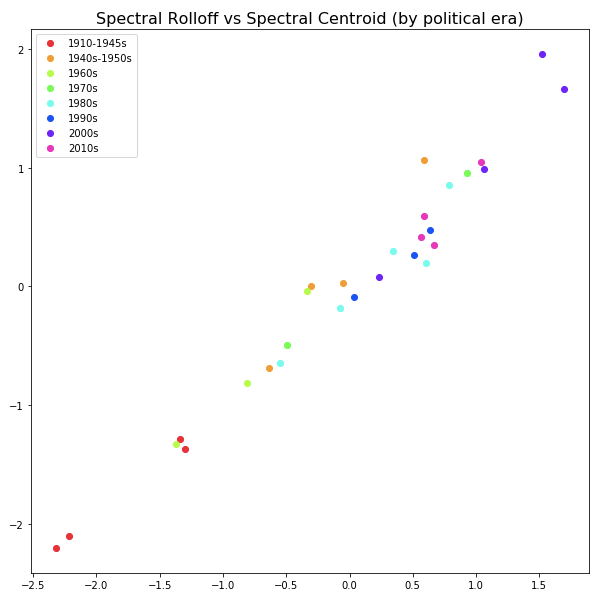
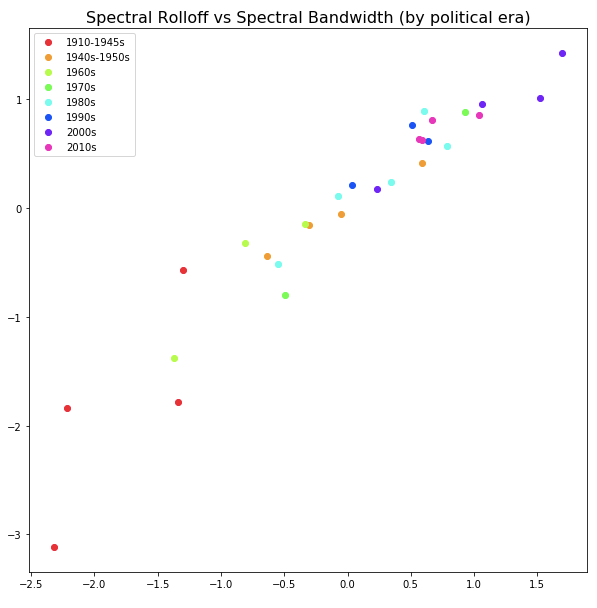
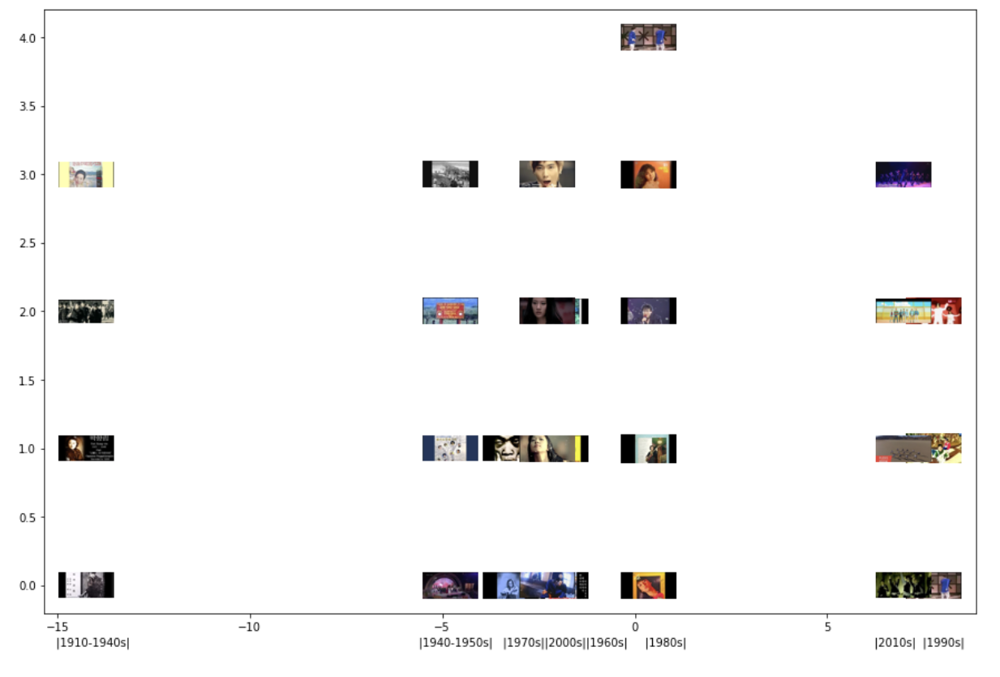
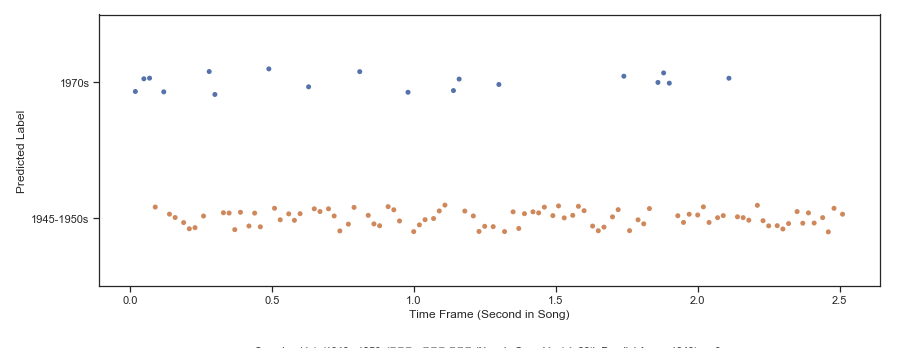
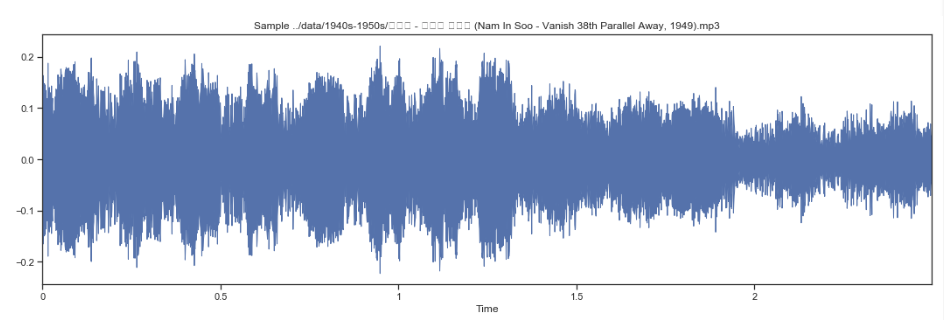

# Project Title

DSC160 Data Science and the Arts - Midterm Project Repository - Spring 2020

Project Team Members: 
- Brian Qian, brqian@ucsd.edu
- Emma Logomasini, elogomas@ucsd.edu
- Nicholas Kho, nikho@ucsd.edu

## Abstract

The Korean music industry is often seen as a bright and fresh representation of East-Asian creativity that has captured the world’s attention. In this project, we will be taking a look at numerous decades of popular music in Korea from the 1910s to the 2010s to understand the connection between distinctive musical styles and major political events that coincide with them. Part of what makes this possible analysis intriguing is that Korea has been under the cultural influence of two major powers in the last century in addition to dealing with oppressive regimes. Our goal is to try to measure the influence of these events in the difference of genres.

Our research question is: do we see similar features in time periods that dealt with similar historical issues, in this case, political repression or economic growth? Our hypothesis is that we will see similarities in periods of great political conflict. To further cognize the influence of political changes, we will be extracting information in forms of features such as MFCCs, temporal, and spectral statistics on a dataset of representative music of each major political era in recent Korean history. Thus we will be able to further attribute certain characteristics towards the political and cultural events, whether positive or negative, that occured within the same timeframe. 

As for the technical process, we will be utilizing jupyterhub and numerous libraries such as Seaborn, matplotlib, and LibROSA to extract and display the features we will be taking into consideration. Our results will be formatted among graphs and charts to give a visual perception of each distinct era of political change. We feel like we can make a “timeline” to represent the different features of each area, and this project will give us further insight into the history of Korean music which has become a global genre in today’s world. Overall, we want to see if there is a correlation between the characteristics of popular Korean music and major political events throughout time, and whether or not the relationship is substantial. 

In terms of dataset, we will be utilizing suggested important songs of each era as outlined in the Sogang University's Professor Huikyong Pang’s class “The Mediums of Korean Cultural Modernity.” In addition, we took a look at Melon [Korean’s music chart ranking since 2004] chart data for recent popular singles to highlight major songs that have impacted the recent decades. As for the major political and cultural events during each era we will be using a [South Korean timeline](https://www.bbc.com/news/world-asia-pacific-15292674) created by BBC.

## Data

From 1910-1945, Korea was under Japanese Colonization where the emergence of mass media, newspapers and Japanese TROT music, notable for its common sad themes, was introduced in the 1920s. By the 1930s the recording industry in Korea began to fully develop with the introduction of the phonograph. During this time, Japan often censored recordings that they deemed "troublesome." The songs we found the most prominent during this era were the following:

    1. "희망가" Huimangga (1925)
    "Huimangga" was a popular Changga (Anti-Japanese) song that was sung to express the people's hope of regaining the country's sovereignty. While the song doesn't have a specific recording or artist, it was one of the earliest pop record that was inspired by Western and Christian hymns

    2. "Glorification of Death" by Yun Sim-deok (1926)
    (not the original recording)

    3. “Tears of Mokpo” by Lee Nan-yeong (1935)
    "Tears of Mokpo" is based off the city, Mokpo, in Korea which became symbolic of Japan's victory and control of Korea.

    4. “My Brother is a Street Musician” (오빠는 풍각쟁이야) by Park Hyang-rim (1938)

Links:
[Huimangga](https://www.youtube.com/watch?v=F-HwLfgi_5o), 
[Glorification of Death](https://www.youtube.com/watch?v=lsxwHLGG_v4&list=LLqp5LSKwhs3T11Fu_neLoBA&index=96), 
[Tears of Mokpo](https://www.youtube.com/watch?v=kNCQjn2GX7M), 
[My Brother is a Street Musician](https://www.youtube.com/watch?v=tev48pcM8ws)

From the 1940s to the 1950s, after the United States liberated Korea from Japanese control (1945), the Korean War (1950-1953) occurred between North Korea and South Korea. During this time Korea was under the right-wing government led by Syngman Rhee (1948-1960), who became known for killing and arresting leftist opponents, political oppression, and taking away term limits for officials. In 1956 the first television station was broadcasted, and in general the 50s brought Korea mass urbanization, a booming popular culture, and Americanization through performers, salons, clubs, and military radio.

    5. "Go Away 38th Parallel" by Nam In Soo (1949)

    6. "Guitar Boogie" by Yoon Ilro (1950)
    The song was a popular iteration of the corresponding Western song that provided dance music to Korea.

    7. "Farewell in Busan Station" (1953)
    (not the original recording)

    8. "Be strong! Keumsun!" (1953)

Links:
[Go Away 38th Parallel](https://www.youtube.com/watch?v=jqkh26uaMAU), 
[Guitar Boogie](https://www.youtube.com/watch?v=4ADWBa9z2Rs), 
[Farewell in Busan Station](https://www.youtube.com/watch?v=tm4HJXZShww), 
[Be Strong! Keumsun!](https://www.youtube.com/watch?v=DpJGl7FYI58)

In the 1960s, the April Revolution began with mass protests against the President Syngman Rhee, eventually leading to his resignation. The same year, South Korea held a democratic election where Yun Bo-soen was elected, but by May 16, 1961 Park Chung-hee began a coup d’etat where he gained the presidency in 1962. In 1961, Korea's 1st government tv broadcasting station, KBS, was created, and Park Chung-hee utilized it to promote anti-communism and Americanization. The 60s in South Korea saw a better economy, more televisions, and American music played on TV. 

    9. “Camelia Lady” by Lee Mi-ja (1964)
    A popular Trot song amogst populace.
    
    10. "A Cup of Coffee" by Pearl Sisters (1968)
    American inspired soul song popular among upper/middle class.
    
    11. "My Beloved Is Far Away; Before Being Late" by Kim Choo-ja (1969)

Links:
[Camelia Lady](https://www.youtube.com/watch?v=y8ChOe12BLs), 
[A Cup of Coffee](https://www.youtube.com/watch?v=4r66aMnWWCM), 
[My Beloved Is Far Away; Before Being Late](https://www.youtube.com/watch?v=WlY29K1k3z0)

In the 1970s, the Yushin Regime was founded as the Fourth Republic of Korea legally allowing Park Chunghee to hold a dictatorship. During this time, there was a curfew that was set and women could get arrested for short skirts among many other laws that were issued. This further caused tension between older generations who valued tradition and the younger generations that were social intellectuals influenced by American values. By the end of the decade in 1979, dictator Park Chunghee was assassinated by the Korean CIA, and the month following, a new coup-de-tat was formed making Cheon Doo-Hwan the new dictator. 

    12. "To The Happy World" by Han dae soo (1974)
    Han dae soo was a popular folk muscian heavily inspired by American youth values, who created music with themes of wanting freedom.
    
    13. "Give me water" by by Han dae soo (1974)

Links:
[To The Happy World](https://www.youtube.com/watch?v=H1cG8BB4fts), 
[Give me water](https://www.youtube.com/watch?v=m3z0HJirgQI)

During the 1980s, the Gwangju Democracy Movement started at the beginning of the decade with massive protests leading to many protesters being killed by the government. The government further blamed the communist party for the protests. By 1987, Roh Tae-woo was announced as the 6th president which led to more major protests, and finally the presidential elections were reinstated. A new "3S" policy was passed to distract the general population from politics with sports, sex, and screen. Under this time, the media was under state control and the teenage demographic became a consumer group.

    14. "좋아해" by Na Mi (1980)
    
    15. "Short Hair" by Cho Yong-Pil (1980)
    "Short Hair" was a popular pop ballad song during the 80s.
    
    16. "그 사람 미워요" by Kim Wan Sun (1986)
    Kim Wan Sun was known as Korea's Madonna
    
    17. "Last night" by SoBangCha (1988)
    SoBangCha was a popular dance trio of Na Mi, Kim Wan Sun, and Park Nam Jung who were all major dance artists that were popular among teens.
    
    18. 'Missing you' by Park Nam Jung (1989)

Links:
[좋아해](https://www.youtube.com/watch?v=8cEvJSY05GQ), 
[Short Hair](https://www.youtube.com/watch?v=c7ZVo6SBQ9Q), 
[그 사람 미워요](https://www.youtube.com/watch?v=qqeusNyLtws), 
[Last night](https://www.youtube.com/watch?v=ErewtVOZn6M), 
[Missing you](https://www.youtube.com/watch?v=g21lBGfnzfs)

The 1990s in South Korea saw the introduction of Neoliberalism which made things more competitive especially for students. The idea of culture also saw a shift into being a commodity, and record labels began shifting into a J-pop inspired model that includes inhouse training, recording, and managing. Labels further focused more on an all-round entertainer over just a musician. In 1995 the major record label, SM entertainment was founded. However by 1997 South Korea faced an economic collapse which devasted the independent music industry. By the end of the decade, the new South Korean president, Kim Dae-jung, issued the "Sunshine Policy" which offered humanitarian aid to North Korea

    19. "COME BACK HOME" by "Seotaiji and Boys" (1995)
    The song was heavily influenced by "gangsta" rap that originated in America.
    
    20. "Candy" by H.O.T (1996)
    H.O.T was considered to be the first major K-pop idol group following the change in the music industry, and their successful model was implemented for the many K-pop groups that came after them.
    
    21. "Im Your Girl" by S.E.S (1997)

Links:
[Come Back Home](https://www.youtube.com/watch?v=q3xy4p2JTfU), 
[Candy](https://www.youtube.com/watch?v=GMsc7wGghy8), 
[Im Your Girl](https://www.youtube.com/watch?v=WpmTLDtr4qY)

In the 2000s, Kim Jong-il of North Korea and the South Korean president, Kim Dae-jung held a submit which lead to a mutual agreement among both leaders. In August of 2000, the Border offices reopen and for the first time North Koreans and South Koreans were allowed to meet. The Korean music market expansion also slowed down, and thus the industry started to go into new asian markets like China. It became so popular that it was called "Hallyu" (Korean Wave) that lead to the extraordinary growth of Korean culture from music to television all around the world. In 2002, the kdrama, Winer Sonata, became a major phenomenon among other Asian countries. While Trot music and Ballads were still very popular at this time, the Kpop groups took over the industry. By the end of the decade, North Korea and South Korea scrapped all military and political deals leading to multiple naval battles. 

    22. "Eat You Up" by BOA (2008)
    
    23. "LA LA LA" by SE7EN (2008)
    
    24. "Rainism" by Rain (2008)
    
    25. "Mirotic" by TVXQ (2008)
    
Links:
[Eat You Up](https://www.youtube.com/watch?v=OLnr2u_nj10), 
[LA LA lA](https://www.youtube.com/watch?v=arUScZVMtgc), 
[Rainism](https://www.youtube.com/watch?v=QDYax6ABb-8), 
[Mirotic](https://www.youtube.com/watch?v=HtJS32n6LNQ)

In the 2010s, the tension between North and South Korea grew with multiple conflicts including exchange of fire across land and sea borders from 2010 to 2014. In 2014, the Sewol ferry incident led to over 200 deaths of South Koreans high schoolers due the captain and crew's misdoings. In 2016, the THAAD missile system was deployed in South Korea which led to the ban of Korean media in China. The following year, President Park Geun-hye was impeached and imprisoned after she allowed a personal friend with a lack of government position to interfere in affairs of state. By the end of the decade after numerous incidents throughout the past few years, North Korea and South Korea agreed to end all hostile actions against each other, and marched under the same flag during South Korea's 2018 Winter Olympics.

    26. "Monster" by EXO (2016)
    
    27. "TT" by Twice (2016)
    
    28. "Don't Wanna Cry" by SEVENTEEN (2017)
    
    29. "DNA" by BTS (2017)

Links:
[Monster](https://www.youtube.com/watch?v=KSH-FVVtTf0), 
[TT](https://www.youtube.com/watch?v=ePpPVE-GGJw), 
[Don't Wanna Cry](https://www.youtube.com/watch?v=zEkg4GBQumc), 
[DNA](https://www.youtube.com/watch?v=MBdVXkSdhwU)

## Code

[Introduction code File](code/introcode.ipynb)

We compiled a list of the most popular songs from popular artists from each time period, downloaded the mp3 files of each one from Youtube, and loaded them into Python. We also looked at whether MFCCs would be a good predictor for each of the years, and we noticed that as time went up, so did the mean MFCC. So we could see an upward trend between mean MFCC and time. We generated a table that displays each thumbnail for every time period and plotted them out to show the growth of MFCC as time went on. 

[Analysis code File](code/analysiscode.ipynb)

For the analysis portion of our code, we decided to extract multiple features including Chroma-based features, spectral centroid, spectral bandwidth, spectral roll off, and zero crossing rate. For our chroma-based features we decided to use 12 (the same amount of coefficents as our MFCCs) and we obtained the mean for all the features among all 29 songs in our database. We then created a dataframe indexed by the political era and further scaled the features to the mean of 0.0 and a standard deviation of 1.0. We then made graphical comparisons among each feature displaying multiple plot graphs to see if there were correlations among each political era. Furthermore to understand the era as a whole, we grouped by political era and obtained the average of every features per decade and displayed subplots to show the growth of features throughout the timeline.

## Results

These subplots show a gradual growth for most spectral features from the 1910s to the 2010s. In certain features like zero crossing rate we see a flucuation from era to era. Most prominently we see a connection from the 1940s-1950s, 1970s where these decades particuarly are known to be politcally repressive eras. In the mfcc means we also see gradual growth with an intensity in the 1990s which was the beginning of the priority of entertainment over politics. 

In these plots we see a distinct gradual relatioship between spectral centroid features and spectral bandwidth features among each decade. It becomes clearer when we displayed the relatioship between spectral rolloff and spectral centroid, that there is a distinct upward trend and most prominently we notice the drastic difference between the 1910s songs and 2010s songs where a century after the music has developed into a full industry. 

This graph displays the thumbnail for each song that we used, and bins them by the mean of their respective time period. As you can see there is an upward trend in the mean mfcc as time goes on, with exceptions to the 2000s.

For these results, we looked at the ability for 1970s and 1945-1950s genres to be predicted; as we found that they were similar, we wanted to show that they would be hard to distinguish. The predictor for these songs only gave .14 accuracy; so there was consistent similarity in genre. Graphed in the first 2.5 seconds and their label prediction for these songs. 

## Discussion

We looked into the statistics based on each time period’s songs. We found that for the most part, there was a continual upward trend for most of the statistics [bandwidth, MCFF, etc]. Overall, there was similarity between decades closer together, and there was a clear linear trend that probably reflected changing preferences in genre. However, we found that some periods had more similarities than expected. 

In particular, there were many similarities in 1970s and 1945-1950s data. We cannot make a definite conclusion, as our dataset was too small; however, both periods of time were known for their political and social oppression in Korea. Additionally, both periods ended with military overthrows of the government. This is culturally relevant because it could measure an idea that is widely accepted: that current events affect artistic expression. Morevermore, it could play into the idea that people respond to oppression in similar ways artisitcally. I don’t believe that people will change the way that they respond to conflict based off this information; however, perhaps this mindset could show that not just genre trends affect what people enjoy; perhaps certain types of songs and melodies resonate better under certain conditions. 

Since we only chose the most popular songs of each time period to represent our data, future directions, we definitely think expanding our database would vastly improve results especially since for some eras they were only represented by two or three artists. To get a better picture of the general sound of each era, we definitely think providing more data would help generate better results. It would be interesting to look into the lyrics of some this dataset and run sentiment analysis. Perhaps that would give us a better understanding of trends between time periods. 

## Team Roles

Provide an account of individual members and their efforts/contributions to the specific tasks you accomplished.
Brian Qian- abstract, provided explanation to the data section, worked on analysis code file, provided and explained results, dicussion
Nicholas Kho- found the data to use, worked on the introduction code file, provided and explained results, dicussion
Emma Logomasini- abstract, found the data to use, provided explanation to the data section, worked on analysis code file, provided and explained results, dicussion

## Technical Notes and Dependencies

No implementation details or notes we needed to repeat our work. 

## Reference

    1. Sogang University's Professor Huikyong Pang’s class “The Mediums of Korean Cultural Modernity.”
    2. BBC's South Korean Timeline, https://www.bbc.com/news/world-asia-pacific-15292674)

